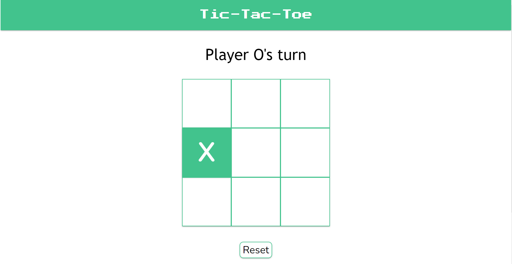

# Tic-Tac-Toe
### A multiplayer tic tac toe game in the browser!

<table>
  <td align="center"><b>Made using:</b></td>
  <td> 
    
    
    
  </td>
</table>

## **Click on the picture/the link below to try!**

## [Click to open](https://redplusblue.github.io/tictactoe/)

## Features: 
1. Supports two players (X vs O).

## What I used/learned: 
1. HTML
2. CSS: Grid, Flexbox, `@media` queries, `@keyframes` 
3. JS: Event Listeners, Modules, Factory Functions, Scope

 

###### An exercise for [TheOdinProject](theodinproject.com)
